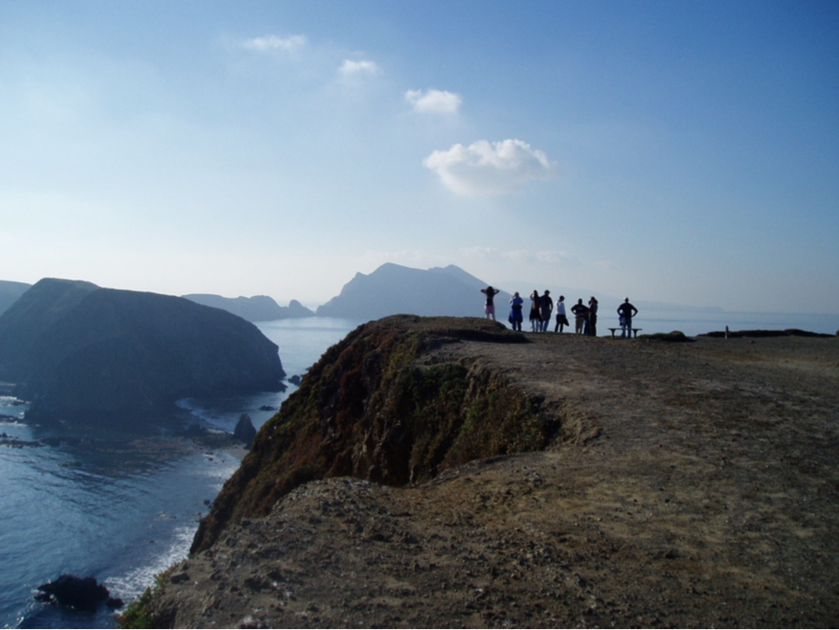
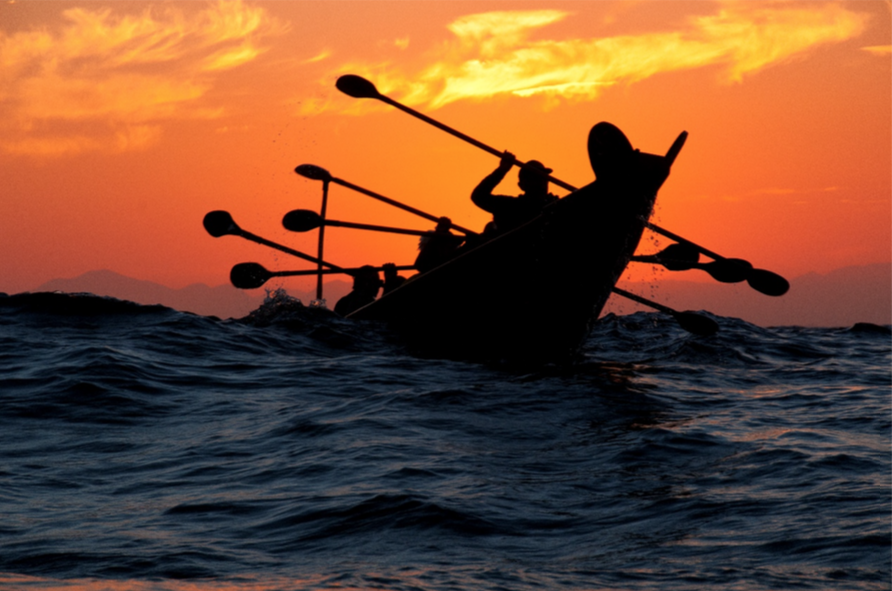

# Site History and Resources

## Overview

Channel Islands National Marine Sanctuary is located off the coast of Santa Barbara and Ventura counties in southern California, 350 miles south of San Francisco and 95 miles north of Los Angeles.
The sanctuary encompasses 1,470 square statute miles (1,110 square nautical miles) of ocean waters surrounding San Miguel, Santa Rosa, Santa Cruz, Anacapa, and Santa Barbara Islands, extending from mean high tide to six nautical miles offshore around each of these five islands (Figures SH.1, SH.2).
The sanctuary was federally designated in 1980 because of its
national significance as an area of exceptional natural beauty and
resources, and due to heightened concerns following the 1969 oil
spill in the Santa Barbara Channel. It is administered by NOAA,
within the U.S. Department of Commerce, and managed to promote ecosystem conservation, protect cultural resources, and support compatible human uses.

### BOX

The sanctuary surrounds and partially overlaps Channel Islands National Park, a terrestrial and marine protected area of national and global significance. The park is administered by the Department of the Interior’s National Park Service. The park consists of 250,000 acres of land on San Miguel, Santa Rosa, Santa Cruz, Anacapa, and Santa Barbara Islands, and waters within one nautical mile of each island (Figure SH.1). Channel Islands National Park monitors and protects threatened and endangered species, restores ecosystems, and preserves the natural and cultural resources for current and future generations.

 

## History

### Human history of the Channel Islands

The Channel Islands and the surrounding waters have a rich human history dating back more than 13,000 years. The Chumash, or island people, are indigenous to the region surrounding the Santa Barbara Channel — the body of water separating mainland California and the Channel Islands (Watts et al. 2008).

Island Chumash were avid mariners who relied greatly on the sea for sustenance. They plied the waters of the islands, channel, and coast in tomols (i.e., redwood plank canoes) to fish and trade with mainland communities.

The maritime society of the Chumash once thrived in villages located throughout the northern Channel Islands and mainland coast. Today, no Chumash dwellings exist on the islands, but a vibrant community remains in southern California where their seafaring traditions are kept alive. (Figure SH.3)

In 1542, Spanish explorer Juan Rodriguez Cabrillo entered the Santa Barbara Channel and is believed to be the first European to land on the islands. Subsequent explorers included Sebastian Vizcaino, Gaspar de Portola, and English captain George Vancouver, who in 1793 assigned the present names to the islands on nautical charts.

In the early 1800s, European settlers relocated the Chumash people from the islands to mainland missions. Soon after, hunters, settlers, fishermen, and ranchers — attracted by the rich natural resources — began to populate the islands.

For the next hundred years, Russian, British, and American fur traders visited the islands and surrounding waters to hunt sea otters, and later seals and sea lions, for their prized fur and oil. Valuable fisheries for abalone and lobster thrived. Cattle and sheep ranches were established and remained active until 1998 when the last herds of cattle were removed (Livingston 2006). All of these activities were largely unregulated at the time and altered the land and ocean ecosystems.

The federal government, and in particular the military, also saw value in the Channel Islands’ strategic location. In 1912, the U.S. Lighthouse Service (later the U.S. Coast Guard) began its stay on Anacapa Island and, in 1932, constructed the Anacapa Island Lighthouse (Figure SH.4) that exists to this day (Wheeler 2002). The U.S. Navy assumed control of San Miguel Island just before World War II and subsequently, the islands served an important role in southern California’s coastal defenses.

The islands’ waters continue to lure people. Culture, commerce, and recreation remain important influences. Federal protections of both the land and waters now recognize the area’s past, present, and future cultural and ecological importance.

