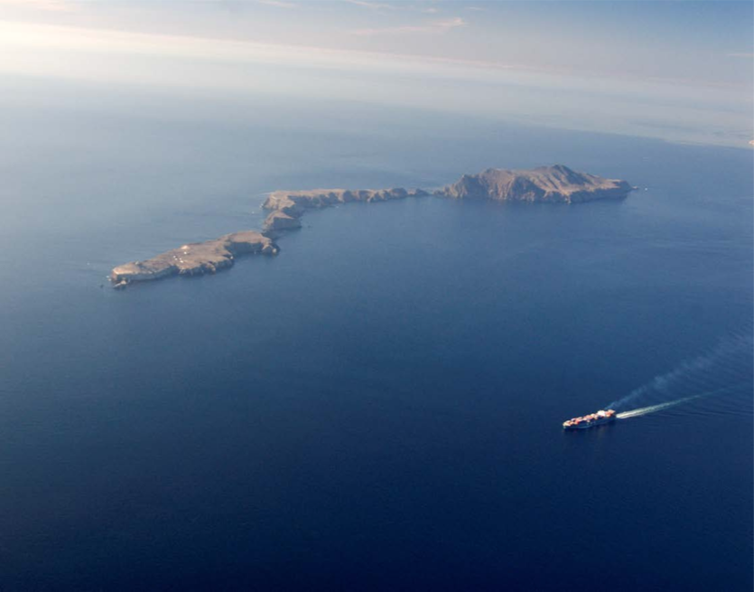
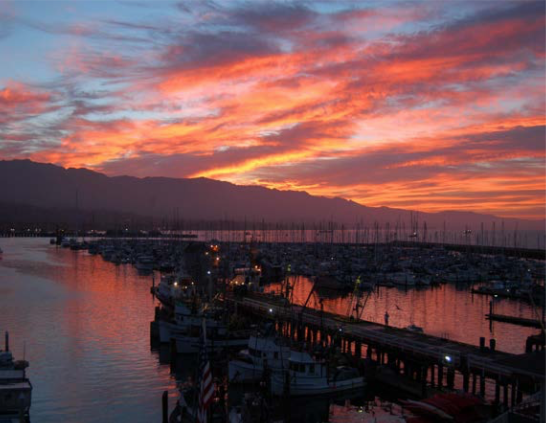

# Driving Forces and Pressures on the Sanctuary

Human activities and natural processes affect the condition of both natural and archaeological resources in national marine sanctuaries. This section describes the general nature and extent of known pressures affecting resources in CINMS. Driving forces behind those pressures are also discussed and can aid in predicting the direction and extent of future pressures. While the trends in drivers and pressures support the assessment of sanctuary resource status and trends (i.e., the State section of this report), forecasts provide a forward-looking approach to address policy and management responses needed to protect and/or restore sanctuary resources (i.e., the Response section of Volume II of this report). This section also addresses five questions about the status and trends of drivers and the human activities (i.e., pressures) influencing major sanctuary resource components — water, habitat, living resources, and maritime archaeological resource quality.

The general approach used herein is to integrate drivers with pressures in the discussions of each pressure; however, since there are several drivers that affect several different pressures, they are addressed in this introduction. Quantitative details are included in this section and are not repeated when each pressure that they affect is discussed.

Two of the most important high-level drivers of status and trends for sanctuary pressures are changes in population growth and per capita income; both operate at multiple scales ranging from local to international and affect demand for resources (e.g., food and access), and thus, levels of activity that alter conditions (e.g., development, shipping traffic, boating, pollution, noise, etc.).

The U.S. population increased 0.9% per year between 2000 and 2015 and is forecast to increase 1.0% per year through 2030 (Woods and Pool 2016). In 2010, 123 million people, or 39 percent of the nation's population lived along the coast. By 2020, NOAA predicts another ten million people will move to a coastal county. **footnote 5**

Nearly one third of California residents (about 11 million people) now live in Los Angeles, Santa Barbara, and Ventura counties, the three counties adjacent to CINMS (U.S. Census Bureau 2016, see
 Appendix C: Table App.C.1.2 and Figure App.C.1.1). Between 2000 and 2015, population in this three county area grew at an annual rate of 0.5 percent. California’s population is projected to increase slightly between 2015 and 2030 (1.1 percent), with the three county area expected to experience an average annual population growth rate of 0.7 percent (Woods and Pool 2016, see Appendix C: Table App.C.1.4).
 
Meanwhile, the standard of living in the three counties has increased faster than the rest of the U.S. Between 2000 and 2015, real per capita income increased 1.3 percent in the U.S. and is forecast to increase 1.6% per year between 2015 and 2030 (Woods and Pool 2016). Between 2000 and 2015, the real per capita income increased 2.5 percent in the three counties; however, increases to real per capita income are expected to even out in the future. Specifically, projections show a 1.6 percent increase for both the U.S. and the three county area between 2015 and 2030 (Woods and Pool 2016, see Appendix C: Tables App.C.1.2, App.C.1.3, and Figure App.C.1.2).

Another major driver of pressures on U.S. resources in general, including those along the West Coast, is Chinese per capita income. China is one of the biggest importers of fishery products from the Channel Islands’ region (NMFS 2017a). As China’s per capita income increases, this is likely to result in an increased demand for all goods, including seafood and other fishery products from CINMS. As stated above, U.S. increases were 1.3% per year between 2000 and 2015. In contrast, China’s Gross Domestic Product (GDP) per capita increased 10% per year between 2008 and 2016 and is forecast to increase 7% per year through 2020 (Trading Economics 2017, see Appendix C: Table App.C.1.5).

A third important and more immediate driver for many ocean activities is the price of fuel. Gas prices are an input to the production of commercial fisheries, ocean recreation and offshore gas exploration. If the price increases, this makes all commercial fishing and ocean recreation activities more costly. Gas prices, for example, declined 29 percent between 2012 and 2017, affecting levels of visitation and various uses. Lower gasoline prices may result in a lowered willingness of producers to invest in exploration and drilling around the sanctuary, as the costs of research and exploration may be prohibitive when the value of gasoline is lower. At the same time, lower gas prices make it less costly to engage in ocean recreation and to visit Channel Islands.

## Vessel Traffic

Private, commercial, and military vessels may affect the sanctuary, adjacent environment, and sanctuary users in several ways, including:

* Air pollution via greenhouse gas emissions
* Discharge of oil, sewage, non-indigenous species, and non-biodegradable materials
* Increased ocean noise impacting living marine resources
* Navigational safety concerns
* Anchor damage to seafloor habitats (e.g., eelgrass, corals) or maritime heritage resources (e.g.,
shipwreck sites)
* Ship strikes on whales, including endangered whale species
* Changes in sanctuary wildlife behavior
* Spills, debris wreckage, and habitat degradation from vessel collisions, groundings, and sinkings

The two busiest commercial shipping ports in North America – Long Beach and Los Angeles – are located just south of the sanctuary. Nearly 9,200 ships (2017 data) annually transit into and out of the ports of Los Angeles and Long Beach, with approximately 41 percent of those transits passing through sanctuary waters (MESC 2018). The ships transit through and near the sanctuary via an internationally approved traffic separation scheme within the Santa Barbara Channel (Figure DP.VT.1). Ships also transit along the south sides of the northern Channel Islands, beyond the sanctuary’s boundary.

Regulatory and economic changes over time have affected the amount and pattern of shipping traffic passing through or around the sanctuary (Figure DP.VT.2). Ship traffic transiting south of the northern Channel Islands increased significantly starting in 2009 when new California state regulations required use of cleaner fuels by ships traversing within 24 nautical miles of the California coast. Since the southern route allowed ships to transit through waters mostly beyond the California Air Resource Board’s (CARB) aforementioned jurisdiction, it thus became a preferred route for many shipping lines that had previously passed through the sanctuary using the traffic separation scheme in the Santa Barbara Channel. Since 2015, however, federal requirements for cleaner ship fuels have also been applied to an Emissions Control Area that extends from 24 to 200 nm offshore, thus lessening the displacement effect of the 2009 CARB fuel requirements. As of the end of 2017, the amount of ships using the Santa Barbara Channel traffic separation scheme had increased to 3,737 transits, almost twice the amount of ship traffic (2,007 transits) traveling just south of the northern Channel Islands (MESC 2018).

Smaller commercial and recreational vessels are also prevalent in the sanctuary. Harbors near the sanctuary contain thousands of recreational, commercial, and research vessels. In turn, these vessels provide year-round opportunities for diving, fishing, sailing, whale watching, and wildlife viewing (Figure DP.VT.3).

Major driving forces of large vessel traffic are population and per capita incomes in the U.S. and China, as these are the main sources of demand for imports and exports through the Ports of Los Angeles and Long Beach. Cargo volume through the two ports increased 18% per year between 1995 and 2007, declined between 2007 and 2009 during the recession, and is forecast to increase at about 5.5% per year for the years 2010 to 2020 and 4.7% per year between 2020 and 2030 (The Tioga Group, Inc. 2009, see Appendix C: Table App.C.1.6). Pressure from both large vessel traffic and small boat use are likely to continue, given forecasted trends for the drivers.

![Figure DP.VT.2. Traffic patterns of large commercial vessels (cargo and tanker vessels) in the Santa Barbara Channel region for 2008, 2010, and 2014. The number of commercial ship transits is shown, using Automatic Identification System (AIS) data transmitted from ships. Vessels transiting to and from the Ports of Los Angeles/Long Beach that pass by the northern Channel Islands use either the Santa Barbara Channel Traffic Separation Scheme around the north side of the islands, or take routes south of the islands. Data source: USCG AIS data, processed by NMFS; Figure: MSWGSS 2016](./figures/p045_DP.VT.2.png)

Non-indigenous Species
The National Marine Sanctuaries Act, which provides for the designation and management of national marine sanctuaries, states that all national marine sanctuaries are intended to maintain “the natural marine assemblages that inhabit the area.” Non-indigenous species are plants and animals living outside their endemic, or native, geographical range. Some non-indigenous species may be benign; however, many become “invasive” species if they cause ecological or economic harm in their newly inhabited environment.
## Non-indigenous Species