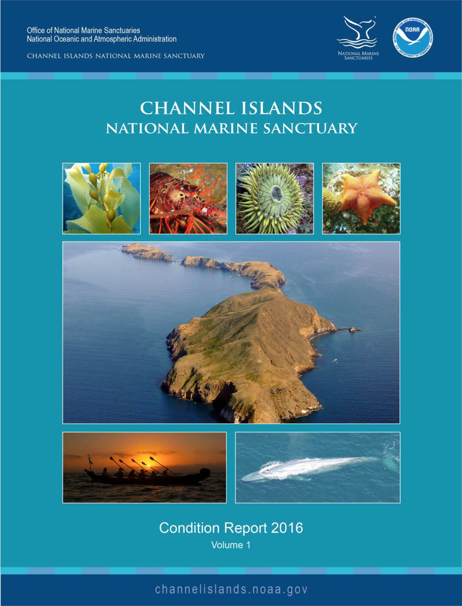
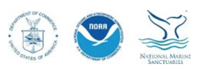

--- 
title: "Channel Islands National Marine Sanctuary - Condition Report, 2016"
site: bookdown::bookdown_site
output: bookdown::gitbook
documentclass: book
bibliography: [style/zotero_nps.bib, style/packages.bib]
biblio-style: apalike
link-citations: yes
github-repo: ecoquants/nps-r-workshop
cover-image: figures/p001_cover.png
description: "Sanctuary condition reports are a tool employed by the National Oceanic and Atmospheric Administration (NOAA) to assess the status and trends of national marine sanctuary resources. Condition reports provide a standardized summary of resources in NOAA’s sanctuaries; drivers and pressures on those resources; current conditions and trends for resources and ecosystem services; and describe existing management responses to the pressures that threaten the integrity of the marine environment. Condition reports include information on the status and trends of water quality, habitat, living resources and maritime archaeological resources, and the human activities that affect them. They present responses to a set of questions posed to all sanctuaries. The reports also rate ecosystem service status and trends. Resource and ecosystem service status are rated on a scale from good to poor, and the timelines used for comparison vary from topic to topic. Trends in the status of resources and ecosystem services are also reported, and are generally based on observed changes in status since the prior condition report, unless otherwise specified."
---

```{r include=FALSE, eval=F}
# automatically create a bib database for R packages
knitr::write_bib(c(
  .packages(), 'bookdown', 'knitr', 'rmarkdown'
), 'style/packages.bib')
```

```{r setup, include=FALSE}
library(tidyverse)
library(knitr)
#library(leaflet)
#library(sf)
opts_chunk$set(echo = F, message = F)

#
```


# Frontmatter {-}

U.S. Secretary of Commerce <br>
Wilbur Ross

Under Secretary of National Oceanic and Atmospheric Administration (NOAA) <br>
RDML Tim Gallaudet, Ph.D., USN Ret. (acting)

Assistant Administrator for National Ocean Service <br>
W. Russell Callender, Ph.D.

Director, Office of National Marine Sanctuaries <br>
John Armor



Cover photos (left to right, from top): Giant kelp, spiny lobster, sunburst anemone, bat star, Anacapa Island, Chumash tomol crossing, blue whale

Photo credits (left to right, from top): Robert Schwemmer/NOAA, Claire Fackler/NOAA, Evan Barba, Claire Fackler/NOAA, Robert Schwemmer/NOAA, Robert Schwemmer/NOAA, Jess Morton/NOAA

Suggested Citation

Office of National Marine Sanctuaries. 2018. Channel Islands National Marine Sanctuary 2016 Condition Report, Volume I. U.S. Department of Commerce, National Oceanic and Atmospheric Administration, Office of National Marine Sanctuaries, Silver Spring, MD. 343 pp.


